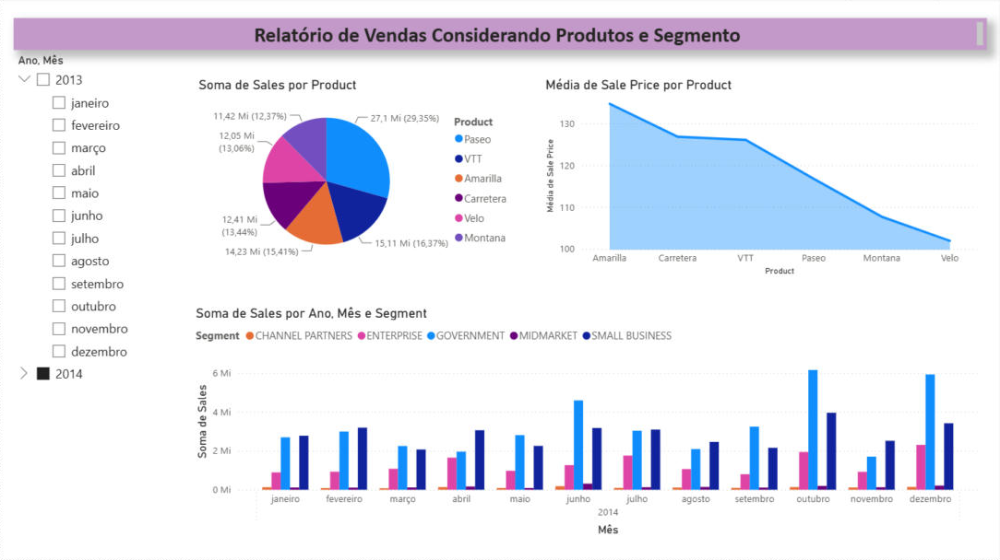
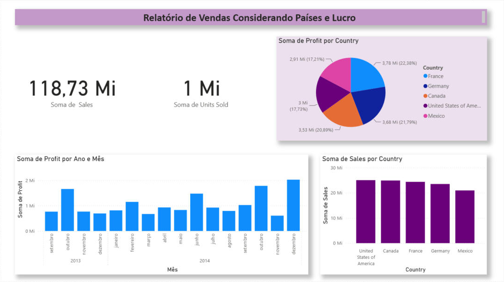
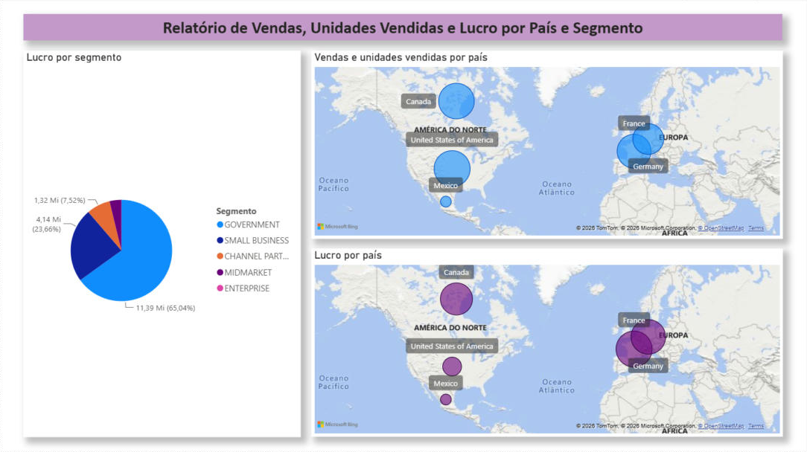

# Desafio de Projeto DIO — Relatório de Vendas com Power BI

Relatório criado no Power BI Desktop para o primeiro desafio de projeto da formação **Power BI Analyst** da [DIO](https://www.dio.me/), usando a base de exemplo **Financial Sample**.

O desafio pede a réplica de duas páginas construídas durante o curso e a criação de uma terceira página com dois mapas e um gráfico de pizza, com atenção à disposição dos visuais, aos títulos e aos campos usados como dica de ferramenta.

## Arquivos

| Arquivo | Conteúdo |
|---|---|
| `desafio_powerbi_financial_sample.pbix` | Relatório do Power BI com as três páginas |
| `prints/` | Imagens das páginas do relatório |

## Páginas do relatório

### Página 1 — Vendas por produto e segmento

- Vendas por produto (pizza)
- Média do preço de venda por produto (área)
- Vendas por ano, mês e segmento (colunas agrupadas)
- Segmentação de dados por ano e mês

### Página 2 — Vendas por país e lucro

- Cartões com o total de vendas e de unidades vendidas
- Lucro por país (pizza)
- Lucro por ano e mês (colunas)
- Vendas por país (colunas)

### Página 3 — Vendas, unidades vendidas e lucro por país e segmento

| Visual | Título | Campos |
|---|---|---|
| Mapa 1 | Vendas e unidades vendidas por país | Localização: `Country` · Tamanho da bolha: soma de `Sales` · Dica de ferramenta: soma de `Units Sold` |
| Mapa 2 | Lucro por país | Localização: `Country` · Tamanho da bolha: soma de `Profit` |
| Pizza | Lucro por segmento | Legenda: `Segment` · Valores: soma de `Profit` |

Pontos de atenção desta página:

- **Dicas de ferramenta:** o mapa aceita um único campo no tamanho da bolha, então as unidades vendidas entram como dica de ferramenta do primeiro mapa. Os campos foram renomeados nos visuais para "Vendas", "Unidades vendidas", "Lucro", "País" e "Segmento".
- **Lucro negativo:** o segmento Enterprise tem lucro negativo (cerca de -614,5 mil). Ele aparece na legenda da pizza, mas não forma fatia, porque o gráfico de pizza não representa valores negativos.

O arquivo também tem duas páginas de dica de ferramenta, usadas por gráficos das páginas 1 e 2.

## Dados

A **Financial Sample** é uma base de exemplo da Microsoft com 700 registros de vendas por segmento, país, produto e data. A cópia usada aqui está no repositório do curso.

## Como abrir

1. Baixe o arquivo `desafio_powerbi_financial_sample.pbix`.
2. Abra no Power BI Desktop.
3. Se os mapas aparecerem desabilitados, vá em **Arquivo > Opções e configurações > Opções > Global > Segurança** e marque **"Usar visuais de Mapa e Mapa Coroplético"**.

## Referência

Repositório do curso, com os dados e os arquivos das aulas: [julianazanelatto/power_bi_analyst](https://github.com/julianazanelatto/power_bi_analyst)
